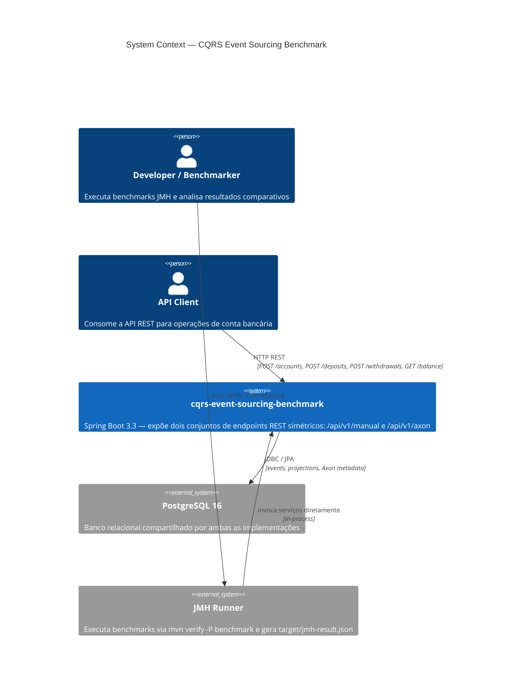
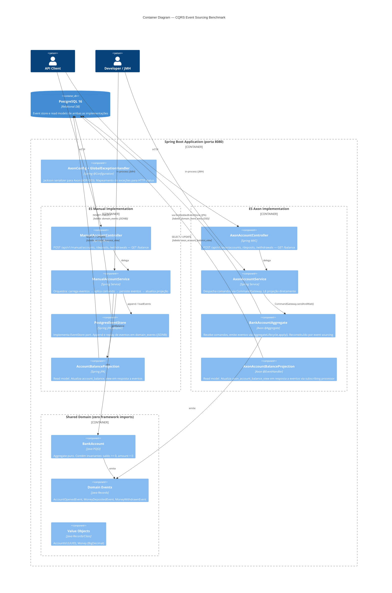
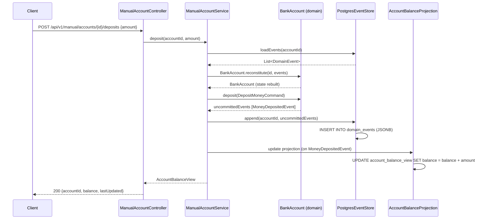
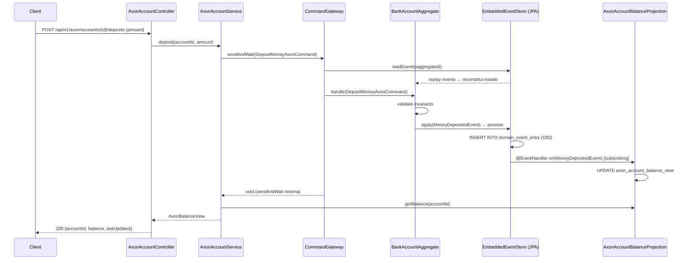

# Architecture — CQRS Event Sourcing Benchmark

> Comparação de implementação: ES Manual (PostgreSQL JSONB) vs ES Axon (Axon Framework 4.9)

---

## C4 Level 1 — Context



---

## C4 Level 2 — Containers



---

## Fluxo de Comando — ES Manual



---

## Fluxo de Comando — ES Axon



---

## Schema de Banco de Dados

```
PostgreSQL 16
│
├── domain_events                    ← ES Manual event store
│   ├── id              BIGSERIAL
│   ├── aggregate_id    UUID
│   ├── aggregate_type  VARCHAR(100)
│   ├── sequence_number BIGINT
│   ├── event_type      VARCHAR(200)
│   ├── payload         JSONB        ← payload legível, consultável
│   └── occurred_at     TIMESTAMPTZ
│
├── account_balance_view             ← Read model Manual
│   ├── account_id   UUID (PK)
│   ├── owner_id     VARCHAR(255)
│   ├── balance      NUMERIC(19,2)
│   ├── last_updated TIMESTAMPTZ
│   └── version      BIGINT
│
├── domain_event_entry               ← ES Axon (schema padrão Axon Framework)
│   ├── global_index         BIGINT (PK, sequence)
│   ├── event_identifier     VARCHAR(255) UNIQUE
│   ├── payload              OID          ← Jackson JSON serializado
│   ├── meta_data            OID
│   ├── aggregate_identifier VARCHAR(255)
│   ├── sequence_number      BIGINT
│   └── type                 VARCHAR(255)
│
├── axon_account_balance_view        ← Read model Axon
│   ├── account_id   VARCHAR(255) (PK)
│   ├── owner_id     VARCHAR(255)
│   ├── balance      NUMERIC(19,2)
│   ├── last_updated TIMESTAMPTZ
│   └── version      BIGINT
│
├── snapshot_event_entry             ← Snapshots Axon (futuro uso)
└── token_entry                      ← Tracking processor state (Axon)
```

> Migrações gerenciadas por **Flyway**: V1 (manual event store) → V2 (balance view) → V3 (Axon tables)

---

## Decisões Arquiteturais

| # | Decisão | Escolha | ADR |
|---|---------|---------|-----|
| 1 | Event store da implementação manual | PostgreSQL JSONB | [ADR-001](docs/adr/ADR-001-postgresql-vs-eventstoredb.md) |
| 2 | Backend do Axon Framework | PostgreSQL JPA (sem Axon Server) | [ADR-002](docs/adr/ADR-002-axon-postgresql-vs-axon-server.md) |
| 3 | Serializador Axon | Jackson (em vez de XStream padrão) | [ADR-003](docs/adr/ADR-003-jackson-vs-xstream-axon-serializer.md) |

**Princípio guia:** ambas as implementações usam a **mesma infraestrutura** (PostgreSQL único, mesmo Docker, sem processos externos) para garantir que os benchmarks JMH meçam o custo do framework, não diferenças de I/O.

---

## Trade-offs: ES Manual vs Axon Framework

| Dimensão | ES Manual | ES Axon |
|----------|-----------|---------|
| **Boilerplate** | Alto — EventStore, StoredEvent, reconstitution loop, event replay manual | Baixo — `@Aggregate`, `@CommandHandler`, `@EventSourcingHandler` fazem o trabalho |
| **Curva de aprendizado** | Baixa — só Java, JDBC, JPA | Alta — conceitos Axon (CommandGateway, AggregateLifecycle, EventProcessor) |
| **Transparência** | Total — código explícito para cada passo do fluxo | Parcial — framework oculta o loop de replay e despacho de eventos |
| **Testabilidade** | `BankAccount.reconstitute()` é puro Java, sem mocks | `AggregateTestFixture` abstrai a infra, mas limita testes fora do fixture |
| **Performance (esperada)** | Ligeiramente mais rápida para operações simples (sem overhead de framework) | Overhead de `CommandGateway` + infraestrutura Axon; compensado por otimizações internas |
| **Extensibilidade** | Extensão manual — saga, retry, dead letter precisam ser implementados | Axon oferece Saga, DLQ, EventScheduler out-of-the-box |
| **Operação em prod** | Apenas PostgreSQL para monitorar | PostgreSQL + configuração de TrackingEventProcessor + token_entry |
| **Migração de schema** | Controle total via Flyway | Dependente do schema Axon (3+ tabelas); atualização do Axon pode alterar schema |
| **LOC (aprox.)** | ~450 linhas (main) | ~280 linhas (main) — framework reduz ~38% do código |
| **Arquivos Java** | 13 arquivos | 9 arquivos |

### Quando escolher ES Manual
- Equipe com domínio profundo de Java/SQL e sem experiência em Axon
- Necessidade de controle total sobre o formato de persistência dos eventos
- Projeto onde o event store precisa ser compatível com múltiplos consumidores não-Java
- Benchmark ou aprendizado de Event Sourcing do zero

### Quando escolher Axon
- Time que já conhece DDD e CQRS e quer produtividade
- Projeto que vai crescer em complexidade (sagas, projections assíncronas, clustering)
- Necessidade de replay de eventos em larga escala (TrackingEventProcessor com particionamento)
- Produção com requisitos de observabilidade via Axon Server (opcional)

---

## Estrutura de Pacotes

```
src/main/java/com/wesleytaumaturgo/cqrs/
│
├── domain/account/          ← Hexagonal: NÚCLEO (zero imports de framework)
│   ├── BankAccount.java           aggregate puro
│   ├── AccountId.java             value object
│   ├── Money.java                 value object
│   ├── commands/                  OpenAccountCommand, DepositMoneyCommand, WithdrawMoneyCommand
│   ├── events/                    AccountOpenedEvent, MoneyDepositedEvent, MoneyWithdrawnEvent (records)
│   └── exceptions/                InsufficientFundsException, AccountNotFoundException
│
├── manual/                  ← Hexagonal: ADAPTADOR MANUAL
│   ├── adapter/                   ManualAccountController + DTOs
│   ├── eventstore/                EventStore (port), PostgresEventStore (adapter), StoredEvent (JPA)
│   ├── projection/                AccountBalanceProjection, AccountBalanceView (JPA entity)
│   └── service/                   ManualAccountService
│
├── axon/                    ← Hexagonal: ADAPTADOR AXON
│   ├── adapter/                   AxonAccountController
│   ├── aggregate/                 BankAccountAggregate + Axon Commands
│   ├── projection/                AxonAccountBalanceProjection, AxonBalanceView (JPA entity)
│   └── service/                   AxonAccountService
│
├── config/                  ← Configuração transversal
│   ├── AxonConfig.java            EmbeddedEventStore + Jackson serializer (ADR-003)
│   └── GlobalExceptionHandler.java
│
└── CqrsBenchmarkApplication.java

src/jmh/java/com/wesleytaumaturgo/cqrs/benchmark/
├── CommandLatencyBenchmark.java        B1 — latência de comando (AverageTime ms)
├── EventThroughputBenchmark.java       B2 — throughput de eventos (ops/s)
├── AggregateReconstitutionBenchmark.java  B3 — replay de 100 eventos (AverageTime ms)
├── ProjectionBenchmark.java            B4 — comando → projeção → leitura (AverageTime ms)
└── ComplexityCostAnalysis.java         B5 — LOC e classes por implementação (análise estática)
```

---

## Como executar

```bash
# Subir PostgreSQL
docker-compose up -d postgres

# Testes de integração (Testcontainers — PostgreSQL efêmero)
mvn test

# Benchmarks JMH (requer PostgreSQL em SPRING_DATASOURCE_URL)
SPRING_DATASOURCE_URL=jdbc:postgresql://localhost:5432/benchmark \
SPRING_DATASOURCE_USERNAME=user \
SPRING_DATASOURCE_PASSWORD=pass \
mvn verify -P benchmark

# Resultados
cat target/jmh-result.json | jq '.[] | {benchmark: .benchmark, score: .primaryMetric.score, unit: .primaryMetric.scoreUnit}'
```
